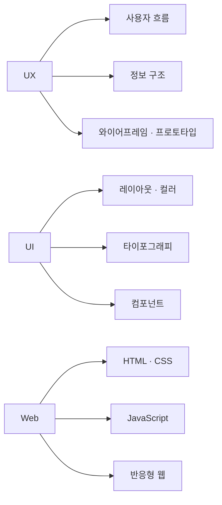

# Designing experiences people actually use.
### 🍀 최유정 / Yujeong Choi

안녕하세요.
사용되는 아름다움에 가치를 두는 UIUX 디자이너이자 웹디자이너입니다.

단순히 보기 좋은 디자인보다
사용자가 자연스럽게 이해하고 오래 머무를 수 있는 경험을 고민합니다.

Figma 기반의 UI 설계부터 HTML / CSS / JavaScript 퍼블리싱까지,
디자인과 구현 사이의 흐름을 이해하는 디자이너를 목표로 하고 있습니다.

---

## ✨ Skills & Tools

**Design**

**Publishing**

**UIUX**
`Responsive Web` `Design System` `Wireframe` `Prototype` `User-centered Design`

---

## 🔄 My Design Process

| 🔍 Research | 📐 Define | 🎨 Design | 🔗 Prototype | 💻 Publish |
|:-----------:|:---------:|:---------:|:------------:|:----------:|
| 사용자 이해 | 문제 정의 | UI 설계 | 인터랙션 | HTML/CSS/JS |
| 요구사항 분석 | 와이어프레임 | Figma 작업 | 사용성 검토 | 퍼블리싱 |

> 단순히 화면을 만드는 것이 아닌,
> **사용자가 자연스럽게 이해하고 오래 머무를 수 있는 흐름**을 설계합니다.

---

## 🧠 Design Thinking

---

## 🌿 Currently

- UIUX 포트폴리오 프로젝트 진행 중
- 프론트엔드 구현 학습 중
- 사람들이 실제로 사용하는 인터페이스 디자인 탐구 중

---

## 📫 Contact

언제든 편하게 연락주세요 :)

📧 E-mail : yuj2905@naver.com
🌐 Portfolio : | 작업 중|
🖼️ Notion : https://bolder-shingle-eec.notion.site/UX-UI-35f65522b1d880fb8ef5e122dc6e3530?source=copy_link
